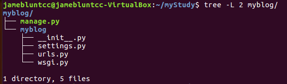
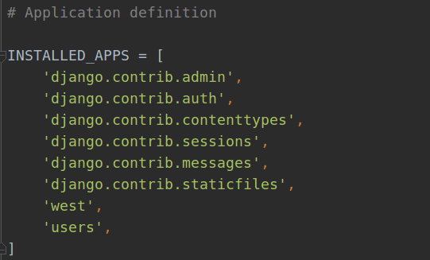
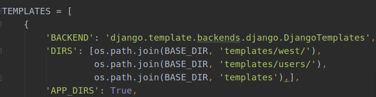
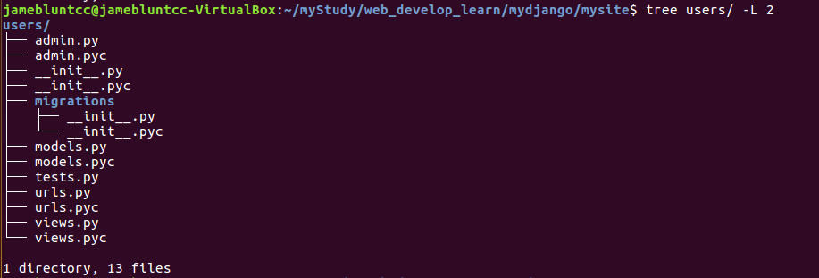

## mydjango

因为工作的原因，很少接触到 [django](https://www.djangoproject.com/) 。还记得很久很久以前写过仿造一个别人的 blog 项目，那是第一次使用 `django` 。当时给我的感觉是它太全面了，基本集成好了 web 开发的所有工具。在对 web 开发理解很有限的那会儿，我一边抄着代码，一边理解，算是写好了基础的 blog 雏形。
工作上我们不需要写很大，很全的 web app，加上教我的师兄是用 [flask](http://flask.pocoo.org/) 写的项目。所以我也就很自然而然的进了 `flask` 的坑。在基本会用 `flask` 后现在回过头来看 `django` 其实本质都相差无几。
所以下面介绍 `django` 会时不时的与 `flask` 作对比。 

### 项目的标准化

第一次使用 `django` 我想大多数的人都是以下面的代码作为一个基本 `django` 项目的起始。

```bash
django-admin startproject mysite
```

当你运行上面那段代码，`django` 会自动的在本地建立一个叫 mysite 的文件夹，里面的结构基本如下：



这个项目就叫 myblog，以自己的输入为准。正如上面所示，启动以一个叫 `manager.py` 的文件作为主文件，然后在此项目下，还有一个叫 myblog 的子文件夹，里面其实就是相当于一个主程序入口，包含了全局的配置，`url` 管理，以及 `wsgi` 的部署。

```bash
python manager runserver
```

不出意外，当运行上面代码后，点开本地浏览器输入 `127.0.0.1:8000` 就可以看到自己的第一个 `django` 应用上线了！
虽然自己在这个时候任何事情都还没有干，但是 `django` 已经默认给我做了很多的事情，比如已经搭建了一个拥有强大交互的后台管理。还有用户认证等等，还有很多的其它工作可以在 `settings.py` 文件中看到：



正如上面看到的，`admin`,`auth`等等，都已经在 INSTALLED_APPS 里集成好了。对于主要写 `flask` 的我来说，这真的是方便多了。但是这里不能直接说 `django`就比 `flask` 好用，`flask` 的定位是"微" 框架，如果你想要和 `django`一样的后台管理或者是认证系统，要么自己实现，要么使用 `flask` 的插件实现，很灵活。所以个人觉得从某个角度来说，并不是像很多人说的那样：学 python web 开发最好从 `flask` 开始，因为 `flask` 比 `django`简单的多。如果要实现一个最基本的应用，不考虑工厂函数，蓝本，各个插件的使用学习成本。也许 `flask` 要比 `django` 简单，但是如果你要实现的是一个比较规模化和模块化的 web app。不见得 `flask` 的学习成本要比 `django`低。

还是回过头来聊聊 `django`。`django`给我的最大感觉就是规范性，`flask` 从不要求项目的布局，而`django`一上来就规定了项目布局，以及应用布局。对于一个大型应用这点确实比较好。大型应用最重要的一点就是项目的规范，也许这也是 `django`为什么受广大公司欢迎的原因吧。

### django settings

在 `django`中，`settings` 保存了基本全部的项目配置信息。就我目前的初步上手来说，比较重要的分别是：
-  ALLOWED_HOSTS  允许 django 使用的 host
-  INSTALLED_APPS 自己实现的功能都需要注册在这个列表下面
-  MIDDLEWARE 各种中间件
-  TEMPLATES 模板路径
-  DATABASES 数据库配置

下面分别说明上面的几个用处：

`ALLOWED_HOSTS` 是设置我们启动 django app 的 host 配置。一般默认的启动是 `127.0.0.1:8000` ，但是如果你要自己进行修改的话。那就要修改 `ALLOWED_HOSTS`

```python
ALLOWED_HOSTS = ['0.0.0.0']
python manager runserver 0.0.0.0::9000
```
上面代码就可以监听本地的全部 host ，以及设置 port 为 9000。

`INSALLED_APPS` 是最重要的一个配置，当我们以下面代码写一个叫 app 的应用时：

```bash
django-admin startapp app
```

就需要在 `INSTALLED_APPS` 下注册这个应用，在 app 列表下添加 `app` 这个应用。

其实我一直觉得比较坑的事情就是关于 `django` 的版本变动，很多时候，因为版本的原因使得有些命令不能正常使用。比如在初始化数据库的时候，前版本是 `python manager syncdb` 但现在的版本是 `python manager makemigrations` 所以使用 `django` 的第一步是检查版本：

```bash
python -c 'import django;print django.VERSION'
```
马上要说到的 `MIDDLEWARE` 就是一个比较坑的东西，当我将数据库初始化后，然后在主页面已经看到 django work 的消息时，满怀欢喜的打开 `/admin/` 时马上报错，说的是 `user` 没有注册。我一开始还以为是数据库初始化或者是迁移有问题，查了半天才发现是版本的问题，settings 文件中的 `MIDDLEWARE` 应该改为 `MIDDLEWARE_CLASSES`。随后可以正常使用 `django` 的后台管理。说到后台管管理，使用过`flask` 的同学应该知道，`flask` 没有自带后台管理，最好的办法就是使用 [flask-admin](http://flask-admin.readthedocs.io/en/latest/)，加上 [flask-login](https://flask-login.readthedocs.io/en/latest/) 实现后台管理。下面说下如何添加数据模型到后台。

首先，自带的后台管理中只有 `Users`与 `Groups` ，如果要添加自定义的数据模型就得先定义模型：

```bash
django-admin startapp blog
```

先建立一个 app，然后在 `settings` 下进行注册，在 blog 下面的 models.py 中写模型的 `ORM`：

```python
from django.db import models

class blog(models.Model):
	name = models.CharField(max_length=50)
	tag = models.CharField(max_length=20)
	create_at = models.DateTimeField(default=datetime.datetime.now())
	...
	def __repr__(self):
		return self.name
```

自己定义的模型都是从 `django.db` 的 `models.Model` 继承的，而表示数据的类型就是 `models.CharField`等等。其实大多数 web 框架的 `ORM` 都是基本相似的，就如著名的 [sqlalchemy](https://www.sqlalchemy.org/) 一样。在 `flask` 中就是使用更多的是使用 [flask-sqlalchemy](http://flask-sqlalchemy.pocoo.org/2.3/) 基本的代码如下：

```python
from flask_sqlalchemy import SQLAlchemy
db = SQLalchemy()

Column = db.Column

class blog(db.Model):
	__tablename__ = 'blog'
	id = Column(db.Integer, primary_key=True)
	name = Column(db.String(50))
	...
	def __repr__(self):
		return self.name
```
核心都是将数据库中的表结果转为类。当自己写好数据模型后，就可以 app 中的 `admin.py` 上进行注册。

```python
from django.contrib import admin
from .models import modelA, modelB

admin.site.register([modelA, modelB])
```

然后运行起程序，就可以在后台管理中看到刚刚注册的模型。还有关于后台管理的布局与自定义内容可以参考[这里](https://docs.djangoproject.com/en/2.0/ref/contrib/admin/)。

`TEMPLATES` 涉及到基本所有 web 框架都会有的模板引擎，django 可以使用自带的模板语言，当然也可以使用其他的语言。
这里我们不会谈模板语言的语法与相关的东西，而是说下在配置文件下的 `TEMPLATES` ，这个参数是配置模板语言路径的， 



如上面所示，首先我们现在 `BASE_DIR` 下建一个叫 templates 的文件夹来存放我们的模板，对于不同的 app 可以将在此文件夹下再建 app 子模板文件夹。这里和使用过蓝本后的 `flask` 模板很类似。

`DATABASES` 是配置数据库的参数，django 默认是使用自带的 `sqlite3` ，当然我们也可以使用最常用的 mysql， 具体的配置如下：

```python
import os
DATABASES = {
	'prod': {
	'ENGINE': 'django.db.backends.mysql',
	'NAME': os.environ.get('DB_NAME'),
	'USER': os.environ.get('DB_USER'),
	'PASSWORD': os.environ.get('DB_PASSWD'),
	'HOST': 'localhost',
	'PORT': '3306',
}
}
```

`DATABASES` 是一个字典数据结构，我们新建一个 prod 字典来配置 mysql ，`ENGINE` 是使用到的数据库类型，可以是默认的 sqlite，也可以是 myql 等等。账号和密码最好是写在环境变量中。

### base auth app

当我们熟悉了基本的配置后，就可以写应用了。下面借助 django 自带的 `auth.contrib.auth`应用实现一个用户登录认证为主的简单 app 进而熟悉 django 的基本使用。因为 django 已经给我们默认建立了 `users` 模型，不再需要我们自己写，当然也可以再继承这个基本的 `users` 加上自己的一些域。

一个最基本的认证需要包括登录与注册，我们这里就分两步进行：

```bash
django-admin startapp users
```
建立 users app 来实现用户的登录和注册。具体的 app 结构如下：



基本的结构与 `flask` 非常类似，包括一个 views 文件写主要的视图，一个 models 写主要的数据模型，test 测试文件，不一样的是 urls 文件保存视图与 url 的 map，一个 admin 实现数据模型的后台管理。migrations 对数据模型的版本控制与迁移。
数据模型已经实现，所以 models 不需要添加任何内容。直接在 views 中写视图函数。

```python
from django.
